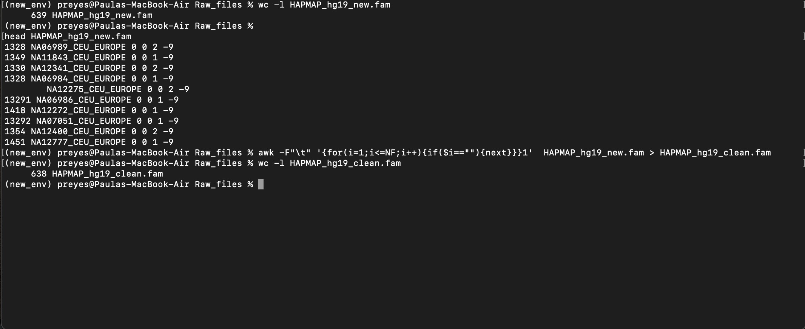
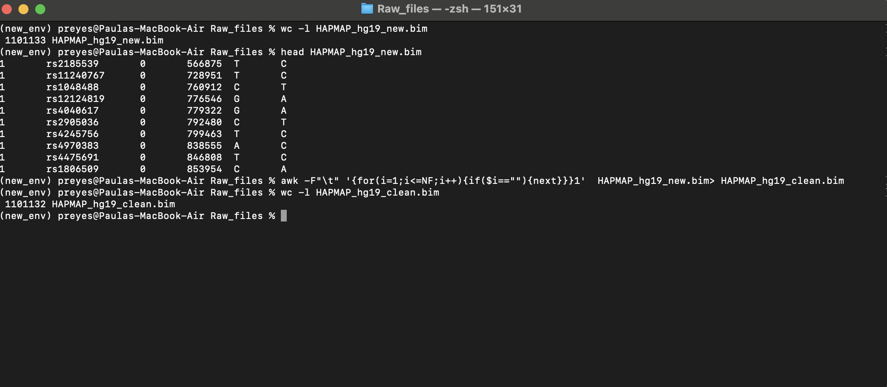
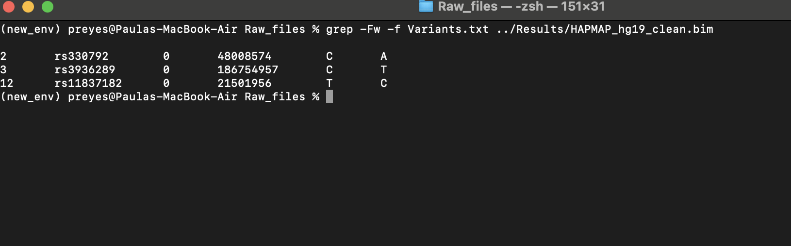

```{r setup, include=FALSE}
knitr::opts_chunk$set(echo = FALSE)
```


# Introducción {data-background=neuron.png data-background-size=1 background-position=right}
- La enfermedad de Parkinson (EP) es una condición neurodegenerativa progresiva que afecta al 1% de la población mayor de 65 años. 
 
- Se manifiesta con síntomas **motores** (bradicinesia, temblor en reposo, rigidez, alteraciones de la marcha e inestabilidad postural) así como síntomas **no motores** (anomalías del estado de ánimo, la cognición y el sueño )

 <br/><br/>

  
#### Sobre el estudio
- La Red Mexicana de Investigación en Parkinson está interesada en recabar datos **genéticos** (a través de técnicas de genotipado) y **epidemiológicos** (a través de encuestas) de pacientes con EP en México.


{width=20%}


Por lo tanto. en este proyecto exploraré 


a. Una pipeline para control de calidad (QC) de muestras de genotipado con datos de repositorios públicos
b. Una visualización de algunos datos epidemiológicos recabados hasta el momento

<br/><br/>

{width=70%}

# **Parte A**: Archivos de genotipado 
- Trabajo en UNIX 


*Pregunta* : 
¿Cómo son los archivos de genotipado y qué información contienen? 

*Objetivo* : 
1. Explorar archivos que contienen datos de genotipado y asegurarse de que estén en buen estado
2. Encontrar si en estos datos de genotipado de pacientes con EP hay 5 SNPs que son de interés para mi proyecto

## Sobre los archivos
- Los archivos fueron descargados de la plataforma Global Parkinson's Genetics Program y corresponden al genotipado de los 22 cromosomas de pacientes con EP de ancestría Europea, Asiática y Africana
- Los archivos que analizaremos son dos (.bed y .fam) y contienen datos sobre las muestras y las variantes 

```{r, engine = 'bash', eval = FALSE, echo=TRUE}
cd /Users/preyes/Documents/Proyectos/ProyectoFinal_UNIX_R
ls
cd Raw_files

wc -l HAPMAP_hg19_new.fam #Cuántos pacientes? 
head HAPMAP_hg19_new.fam
# El archivo fam contiene la información de las muestras que vamos a estudiar
#1 Familiar ID
#2 Individual ID
#5 Sexo 1=male, 2=female
#6 Afectado 1=control, 2=case


#En este caso   queremos asegurarnos de que no haya "valores perdidos"

awk -F"\t" '{for(i=1;i<=NF;i++){if($i==""){next}}}1'  HAPMAP_hg19_new.fam > HAPMAP_hg19_clean.fam
wc -l HAPMAP_hg19_clean.fam 

```

{width=120%}
```{r, engine = 'bash', eval = FALSE, echo=TRUE}

#Enviamos los archivos a la carpeta correcta

mv  HAPMAP_hg19_clean.bim ../Results
mv  HAPMAP_hg19_clean.fam ../Results
```


```{r, engine = 'bash', eval = FALSE, echo=TRUE}
wc -l HAPMAP_hg19_new.bim  #Cuántas variantes? 
head HAPMAP_hg19_new.bim

#El archivo bim contiene la información sobre las variantes en el genotipo
#1 Cromosoma
#2 Posición en el genoma

awk -F"\t" '{for(i=1;i<=NF;i++){if($i==""){next}}}1'  HAPMAP_hg19_new.bim> HAPMAP_hg19_clean.bim
wc -l HAPMAP_hg19_clean.bim
```

{width=120%}


También, deseo extraer datos sobre 5 variantes que son de mi interés dado que están relacionadas a declive cognitinivo y ansiedad o depresión

```{r, engine = 'bash', eval = FALSE, echo=TRUE}
grep -Fw -f Variants.txt ../Results/HAPMAP_hg19_clean.bim
```

{width=120%}

<br/><br/>
{width=120%}
<br/><br/>


##  **Parte B**: Visualización de datos epidemiológicos

- Empleando R Studio

*Objetivo* caracterizar a los pacientes de EP registrados a la fecha

Nuestros datos vienen de RedCap, la plataforma donde colectamos los datos de los pacientes, que genera un archivo CVS como salida.

```{r, echo=TRUE, message=FALSE, warning=FALSE}
#Cargamos las librerías necesarias
library(dplyr)
library(ggplot2)
library(mxmaps)
library(data.table)
library(janitor)
library(fuzzyjoin)
library(ggplot2)
library(lemon)
```


Cargamos el dataset crudo
```{r, echo=TRUE}

PD_raw <- read.delim("~/Documents/Proyectos/ProyectoFinal_UNIX_R/Raw_files/raw_datosepidemio.csv", sep=",", header= 1)

PD_raw<-data.frame(PD_raw, stringsAsFactors = FALSE)

PD_raw$Sex <- as.factor(PD_raw$Sex)
glimpse(PD_raw)
```

1. ¿De dónde vienen los pacientes?
```{r, echo=TRUE}

#En esta parte únicamente realizamos un subset de la frecuencia de registros por estado
states <-select(PD_raw, ID, State) %>% data.frame()
states <- states[complete.cases(states), ]
freq_st<-table(states$State)
freq_st<-data.frame(freq_st, stringsAsFactors = FALSE)

#Y a partir de aquí solo ajustamos para que podamos utilizar el paquete mxmaps
colnames(freq_st)[1]<-"region"
colnames(freq_st)[2]<-"freq"
freq_st[,1]<- as.character(freq_st[,1])
state_table <- as_tibble(data.frame(freq_st))
colnames(state_table) <- c("new_state_name", "Freq")
df.mxstate <- as_tibble(df_mxstate)
state_freq <- regex_left_join(df.mxstate, state_table, by=c(state_name = "new_state_name"), ignore_case=TRUE)
state_freq$new_state_name = state_freq$state_name
state_freq$Freq[is.na(state_freq$Freq)] = 0
state_freq$value <- state_freq$Freq 
mxstate_choropleth(state_freq, 
                   num_colors = 1,
                    title = "Registros por estado, n= 33") 
```


2. Visualización de la frecuencia de los 4 síntomas motores más comunes de la EP

```{r, echo=TRUE}
MS <-select(PD_raw, Bradykinesia, Muscula.rigidity, Postural.instability, Resting.Tremor)
MS<-as.data.frame(MS)
MS <- (MS[complete.cases(MS), ])

```


```{r, echo=TRUE}
# Creamos un data frame con las frecuencias
Bradykinesia<-table(MS$Bradykinesia)
Muscular_rigidity<-table(MS$Muscula.rigidity)
Postural_instability<-table(MS$Postural.instability)
Resting_Tremor<-table(MS$Resting.Tremor)

Motor_Symp <- cbind(Bradykinesia, Muscular_rigidity, Postural_instability, Resting_Tremor)

barplot(Motor_Symp,beside=TRUE, xlab="Síntomas motores", ylab = "Frecuencia" ,
          names.arg = c("Bradicinesia", "Rigidez", "Inestabilidad", "Tremor de reposo"))

```


Otro interés es detectar aquellos pacientes que podrían estar viviendo síntomas neuropsiquiátricos de interés clínico. Esto se hace a través del instrumento SCL-90R, donde el punto de corte es de 70 puntos


```{r, echo=TRUE}
sint_neuropsi <-PD_raw[, c(13:21)] %>% filter_all(any_vars(!is.na(.))) %>% as.data.frame()
SCL90<- mutate(sint_neuropsi, SUMA=rowSums(sint_neuropsi)-66) %>%filter(SUMA>=70)
```

```{r, render=lemon_print}
SCL90
```


Finalmente, se realizó la prueba Montreal Cognitive Assessment (MoCA), debido a que el declive cognitivo es el síntoma que más afecta la calidad de vida de los pacientes. 


*Pregunta* ¿Qué factores influyen en el las funciones cognitivas, medidas con la prueba MoCA?

*Hipótesis* El puntaje de la prueba MoCA está correlacionado con
a) Edad del paciente
b) Años de estudio


*Diseño* Se construirá un data frame conteniendo los datos para Edad, Años totales de educación y puntaje MoCA para cada paciente, posteriormente se llevarán a cabo pruebas estadísticas para comprobar la correlación


```{r, echo=TRUE, warning=FALSE}

MOCA <- mutate(PD_raw, Age=2021-(PD_raw$Year.of.birth))
MOCA <- select(MOCA, Age, Total.number.of.years.of.education, MoCA..score, Sex) %>% 
  filter_all(any_vars(!is.na(.)))
                                                                      
MOCA_edu <- ggplot(MOCA, aes(Total.number.of.years.of.education,MoCA..score, color=Sex)) + 
  geom_point() + ylab("Puntaje de evaluación cognitiva") + 
  xlab("Años de educación formal")

MOCA_edad <- ggplot(MOCA, aes(Age,MoCA..score, color=Sex)) +
  geom_point() + 
  ylab("Puntaje de evaluación cognitiva") + xlab("Edad")

```


```{r}
MOCA_edu
MOCA_edad
```

Para probar esta correlación utilizaremos una prueba Spearman

```{r, warning=FALSE, echo=TRUE}
cor.test(MOCA$Total.number.of.years.of.education,PD_raw$MoCA..score, method="spearman")

cor.test(MOCA$Age,PD_raw$MoCA..score, method="spearman")
```


### *Conclusiones* **parte B**

1. La mayor parte de nuestros pacientes residen en Michoacán.

2. El síntoma motor más común es la bradicinesia 

3. Hay al menos 3 pacientes con síntomas neuropsiquiátricos de significancia clínica -> informar a sus médicos tratantes

4. Existe una correlación entre el Puntaje de evaluación cognitiva del paciente y la cantidad de años que asistió a la escuela


